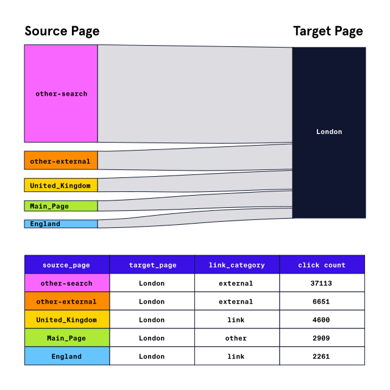

# Analyzing-Wikipedia-Clickstreams-with-PySpark

In this project, we’re going to continue working with Wikipedia’s open-source datasets. Wikipedia maintains a dataset called “Clickstream” that records clicks between pairs of linked Wikipedia articles. Because not all readers arrive at a Wikipedia article by clicking a link from another, the dataset also includes categories for clicks that originate outside of Wikipedia (e.g., external-search tracks all clicks coming from major search engines).

  

This excerpt tells us about 37,000 people accessed the page for London from an external search engine, and about 4,600 people accessed the page by clicking on a link from the Wikipedia article titled “United Kingdom”. In this project, we’ll clean and analyze a sample of the English language Wikipedia’s Clickstream data from January 2018 using PySpark SQL.

We encourage you to try this on your own, but we’ve included a solution file named solution.ipynb as well that you can access by clicking on the Jupyter logo at the top left of the web browser within the learning environment. Or select the View Solution Notebook link at the top of the notebook to view the solution as an HTML file in a new window.

Be sure to save your work as you go by clicking on the save icon. You can also download a copy of your notebook to reference later by navigating to File>Download as>Notebook (.ipynb). If you would like to try this project off-platform,